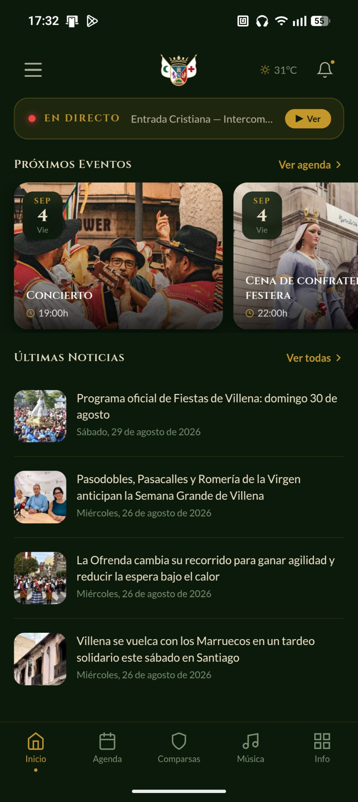
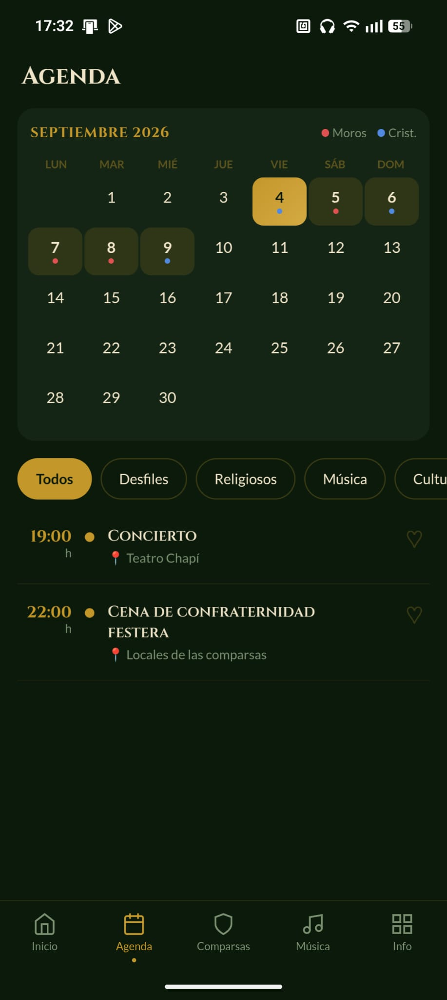
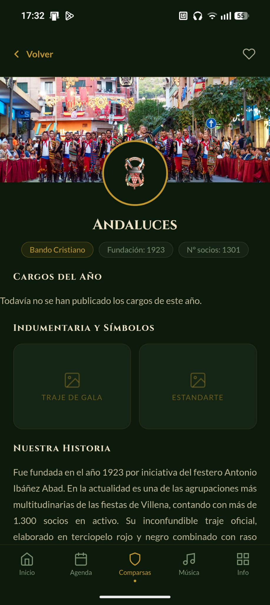
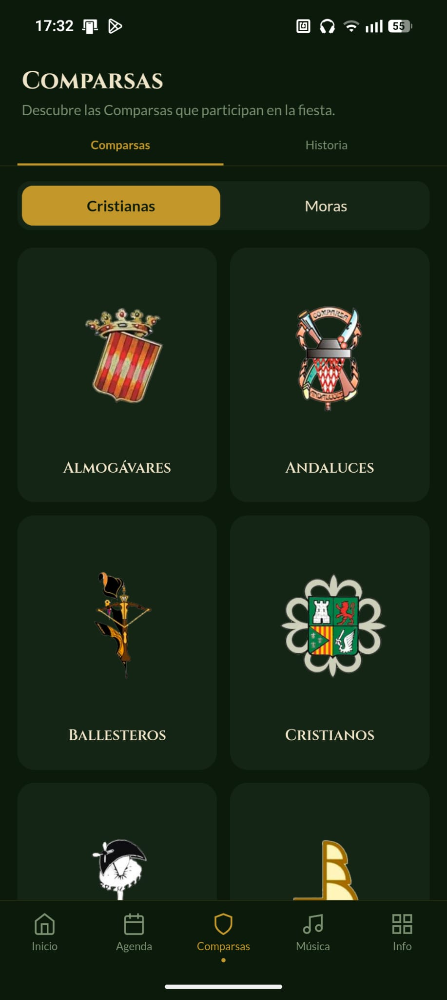
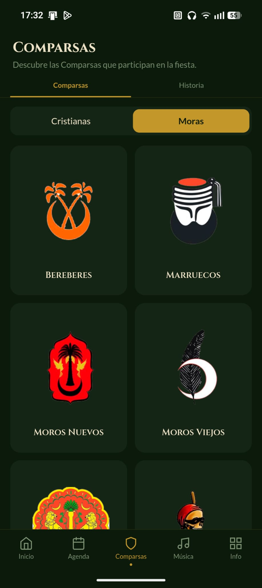
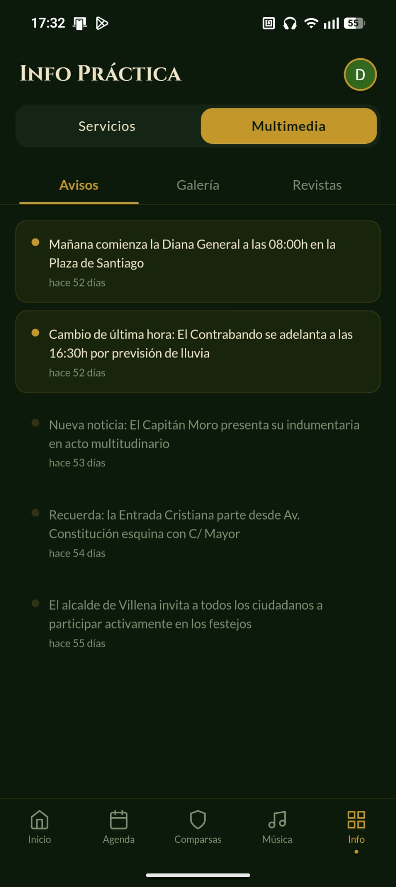

<div align="center">

# ⚔️ Villena App — Fiestas de Moros y Cristianos 🏰

### *La experiencia digital definitiva para vivir las Fiestas de Villena en tu bolsillo*

[](https://react.dev/)
[](https://www.typescriptlang.org/)
[](https://vitejs.dev/)
[](https://supabase.com/)
[](https://capacitorjs.com/)
[](#-arquitectura-offline-first--a-prueba-de-aglomeraciones)

<br />

**Villena App** es una aplicación multiplataforma (*Web SPA + iOS / Android*) diseñada a medida para festeros, vecinos y visitantes de las emblemáticas **Fiestas de Moros y Cristianos de Villena** (del 5 al 9 de septiembre, *Fiesta de Interés Turístico Internacional*).

Combina una experiencia visual cuidada al detalle con una ingeniería orientada a la **máxima resiliencia y velocidad en entornos de alta concurrencia**.

## 📱 Capturas de la Aplicación

<div align="center">

| 🏰 Inicio & Cuenta Atrás | 📅 Agenda & Filtros | 🛡️ Ficha de Comparsa | 🎺 Villena Suena |
|:---:|:---:|:---:|:---:|
|  |  |  |  |

<br />

| ⚔️ Comparsas Cristianas | 🌙 Comparsas Moras | 🗺️ Servicios & Sedes | 🔔 Tablón de Avisos |
|:---:|:---:|:---:|:---:|
|  |  |  |  |

</div>

<br />

---

## ✨ Características Destacadas

<table>
  <tr>
    <td width="50%" valign="top">
      <h3>📅 Agenda Festera Inteligente</h3>
      <ul>
        <li><strong>Cronograma completo (5 al 9 de Septiembre):</strong> Todos los actos oficiales clasificados por día y hora.</li>
        <li><strong>Filtrado por categorías:</strong> <em>Desfiles</em>, <em>Religiosos</em>, <em>Música</em> y <em>Cultural</em>.</li>
        <li><strong>Mis Favoritos:</strong> Guarda tus actos imprescindibles con persistencia en el dispositivo.</li>
        <li><strong>Enlace directo a recorridos:</strong> Conoce por dónde pasa cada desfile con un solo clic.</li>
      </ul>
    </td>
    <td width="50%" valign="top">
      <h3>🛡️ Directorio de las 14 Comparsas</h3>
      <ul>
        <li><strong>7 Cristianas y 7 Moras:</strong> <em>Estudiantes, Marinos Corsarios, Contrabandistas, Almogávares, Cristianos, Mirenos, Caballeros del Temple · Moros Viejos, Moros Nuevos, Bando Marroquí, Realistas, Nazaríes, Bereberes, Piratas</em>.</li>
        <li><strong>Fichas completas:</strong> Historia, año de fundación y número de socios.</li>
        <li><strong>Galería festera:</strong> Trajes de gala, desfile y estandarte.</li>
        <li><strong>Cargos Oficiales:</strong> Capitán, Alférez y Madrina con foto y rol.</li>
      </ul>
    </td>
  </tr>
  <tr>
    <td width="50%" valign="top">
      <h3>🗺️ Mapa en Vivo & Recorridos GPS</h3>
      <ul>
        <li><strong>Trazado interactivo de desfiles:</strong> Polilíneas geoespaciales sobre el callejero real de Villena.</li>
        <li><strong>Sedes y Puntos de Servicio (POIs):</strong> Ubicación de las 14 sedes de comparsas, puestos de primeros auxilios, aseos públicos y zonas de aparcamiento.</li>
        <li><strong>Geolocalización & Brújula digital:</strong> Orientación en tiempo real para moverte con soltura entre desfiles.</li>
      </ul>
    </td>
    <td width="50%" valign="top">
      <h3>🎺 "Shazam Festero" & Web Audio</h3>
      <ul>
        <li><strong>Reconocedor lúdico de marchas:</strong> Identifica y reproduce obras maestras de la música festera (<em>Chimo, La Entrada, El Moro del Sinc, Jauja...</em>).</li>
        <li><strong>Sintetizador Web Audio API:</strong> Motor de osciladores, envolventes y filtros analógicos en el cliente.</li>
        <li><strong>Respuesta háptica:</strong> Vibraciones inmersivas en terminales móviles con <code>@capacitor/haptics</code>.</li>
      </ul>
    </td>
  </tr>
  <tr>
    <td width="50%" valign="top">
      <h3>🔔 Avisos Oficiales & Alertas Push</h3>
      <ul>
        <li><strong>Comunicación en directo:</strong> Tablón de noticias y avisos urgentes emitidos por la organización.</li>
        <li><strong>Notificaciones Push nativas:</strong> Avisos instantáneos ante cambios de hora, incidencias o alertas meteorológicas.</li>
        <li><strong>Widget de Clima integrado:</strong> Previsión del tiempo hora a hora para cada día de fiestas.</li>
      </ul>
    </td>
    <td width="50%" valign="top">
      <h3>🛠️ Backoffice de Administración</h3>
      <ul>
        <li><strong>Gestión protegida por roles (RBAC):</strong> Control de acceso con <code>AdminGuard</code> y Supabase Auth.</li>
        <li><strong>Editor visual de rutas:</strong> Trazado interactivo de polilíneas sobre mapa con clics directos.</li>
        <li><strong>Gestión integral de contenidos:</strong> CRUD de eventos, comparsas, cargos y subida de imágenes a Supabase Storage.</li>
      </ul>
    </td>
  </tr>
</table>

<br />

---

## ⚡ Arquitectura Offline-First — *A prueba de aglomeraciones*

En plena calle, rodeado de miles de personas durante la Entrada o la Cabalgata, las redes móviles suelen saturarse. **Villena App está diseñada para no fallar jamás**:

```
                       ┌─────────────────────────┐
                       │  Usuario solicita datos │
                       └────────────┬────────────┘
                                    │
                         ¿Caché local en TTL?
                           ├── SÍ ──► [ Render Instantáneo ]
                           └── NO
                                    │
                    Petición Supabase con withTimeout(8s)
                      ├── 200 OK ──► [ Guarda en Caché + Renderiza ]
                      └── Timeout / Sin Red
                                    │
                        ¿Existe caché caducada?
                          ├── SÍ ──► [ Rescate con cache.getStale() ]
                          └── NO ──► [ Carga Dataset Estático /src/data ]
```

- 🚀 **Cero pantallas en blanco:** Si la conexión cae, la app recupera el último estado conocido o los datos estáticos embebidos.
- ⏱️ **Guarda de 8 segundos:** Cancela peticiones colgadas mediante `AbortController` antes de que el usuario perciba lentitud.
- 💾 **Persistencia multi-sesión:** La caché sobrevive al cierre de la app gracias a `localStorage`.

<br />

---

## 📐 Diagramas de Arquitectura y Sistema

Documentación visual completa generada con diseño editorial y especificación vectorial interactiva:

> 💡 *Puedes abrir el **[Panel Central de Diagramas (HTML interactivo)](docs/diagrams/index.html)** en tu navegador para ver la galería completa.*

---

<details open>
<summary><b>🏛️ 01. Arquitectura General y Topología Híbrida</b> (Clic para expandir/colapsar)</summary>
<br />
<p><i>Capas de presentación React 18, integración de hardware nativo con Capacitor, servicios de resiliencia y Supabase BaaS.</i></p>


👉 [Abrir versión HTML interactiva](docs/diagrams/01-architecture-overview.html)
</details>

---

<details open>
<summary><b>⚡ 02. Flujo de Resiliencia de Datos y Estrategia Offline-First</b> (Clic para expandir/colapsar)</summary>
<br />
<p><i>Algoritmo de triple rescate en aglomeraciones (withTimeout 8s → Persistent TTL Cache → Stale LocalStorage → Static Seed Fallback).</i></p>


👉 [Abrir versión HTML interactiva](docs/diagrams/02-resilience-offline-flow.html)
</details>

---

<details open>
<summary><b>🗄️ 03. Modelo Entidad-Relación y Dominio</b> (Clic para expandir/colapsar)</summary>
<br />
<p><i>Esquema PostgreSQL en Supabase con tipos TypeScript (eventos, comparsas, cargos, rutas geoespaciales, avisos y push tokens).</i></p>


👉 [Abrir versión HTML interactiva](docs/diagrams/03-database-er-model.html)
</details>

---

<details open>
<summary><b>🔔 04. Secuencia de Notificaciones Push y Alertas en Tiempo Real</b> (Clic para expandir/colapsar)</summary>
<br />
<p><i>Flujo temporal desde el registro del token en el terminal móvil (APNs/FCM) hasta el broadcast de avisos urgentes con Trigger SQL.</i></p>


👉 [Abrir versión HTML interactiva](docs/diagrams/04-push-notifications-sequence.html)
</details>

---

<details open>
<summary><b>🗺️ 05. Mapa de Navegación, Rutas y Estado de la SPA</b> (Clic para expandir/colapsar)</summary>
<br />
<p><i>Jerarquía de rutas en React Router 7, división en lazy chunks, modales interactivos y persistencia en LocalStorage.</i></p>


👉 [Abrir versión HTML interactiva](docs/diagrams/05-navigation-state-map.html)
</details>

---

<details open>
<summary><b>📍 06. Proceso de Edición y Publicación de Rutas Geoespaciales</b> (Clic para expandir/colapsar)</summary>
<br />
<p><i>Flujo de backoffice con AdminGuard, trazado interactivo de polilíneas GPS sobre Leaflet y renderizado en la app de usuario.</i></p>


👉 [Abrir versión HTML interactiva](docs/diagrams/06-admin-route-editor-process.html)
</details>

<br />

---

## 🛠️ Puesta en Marcha y Guía Técnica

<details>
<summary><b>💻 Instrucciones de Instalación, Entorno y Scripts (Clic para ver)</b></summary>
<br />

### Requisitos previos
- **Node.js 18+** y **npm**
- *(Opcional)* Cuenta en [Supabase](https://supabase.com/). Sin configurar, la app funciona en modo autónomo con los datos locales de ejemplo.

### Instalación local

```bash
# 1. Clonar el repositorio e instalar dependencias
git clone https://github.com/dukecorse1972/villena-ap.git
cd villena-ap
npm install

# 2. Configurar variables de entorno (opcional)
cp .env.example .env.local

# 3. Arrancar el servidor de desarrollo
npm run dev
```

### Scripts de desarrollo y calidad

| Comando | Acción |
|---|---|
| `npm run dev` | Inicia el dev server con Hot Module Replacement |
| `npm run build` | Compila TypeScript y empaqueta la versión optimizada en `dist/` |
| `npm run preview` | Previsualiza el build de producción en local |
| `npm run typecheck` | Comprueba tipos con `tsc --noEmit` |
| `npm run test` | Ejecuta la suite de tests unitarios y de integración con Vitest |
| `npm run test:coverage` | Reporte completo de cobertura de tests |
| `npm run lint` | Análisis estático de código con ESLint |
| `npm run format` | Formateo automático de código con Prettier |

### Empaquetado Nativo Móvil (Capacitor)

El código fuente web de `src/` se compila directamente para iOS y Android sin duplicar lógica:

```bash
npm run cap:sync      # Genera el build y sincroniza los assets con android/ e ios/
npm run cap:android   # Sincroniza y abre el proyecto en Android Studio
npm run cap:ios       # Sincroniza y abre el proyecto en Xcode (requiere macOS)
```

</details>

<br />

---

<div align="center">

**Villena App — Fiestas de Moros y Cristianos**  
*Hecho con pasión por las tradiciones de Villena y la excelencia técnica.*

</div>
