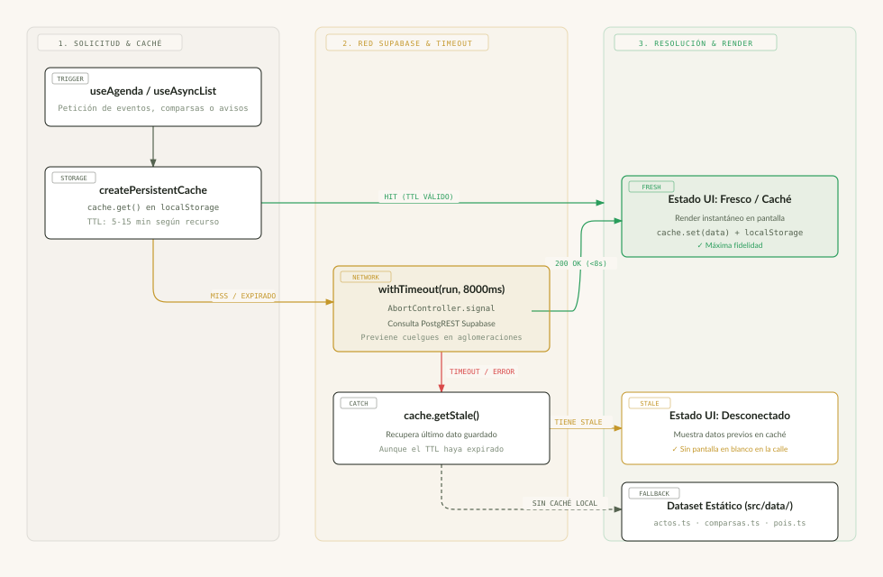
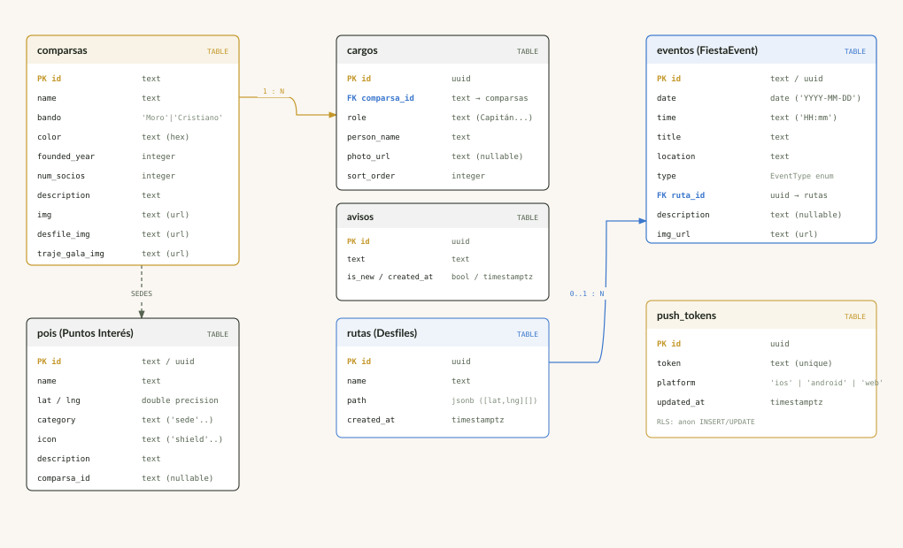

# Villena App — Fiestas de Moros y Cristianos

Aplicación web (SPA) con la agenda de actos, comparsas e información práctica de las Fiestas de Moros y Cristianos de Villena.

> Nota: el stack real de este proyecto es **React + TypeScript + Vite + Supabase**, no Flutter.

## Stack

- [React 18](https://react.dev/) + [TypeScript](https://www.typescriptlang.org/)
- [Vite](https://vitejs.dev/) (build tool y dev server)
- [React Router 7](https://reactrouter.com/) (navegación)
- [Supabase](https://supabase.com/) (base de datos, auth y backend)
- [Vitest](https://vitest.dev/) + Testing Library (tests)
- [Capacitor](https://capacitorjs.com/) (empaquetado como app nativa iOS/Android)

## Requisitos

- Node.js 18+
- Una cuenta/proyecto de Supabase (opcional — sin configurar, la app funciona con datos locales de ejemplo)

## Puesta en marcha

```bash
npm install
cp .env.example .env.local   # y rellena las claves de tu proyecto de Supabase
npm run dev
```

## Scripts disponibles

| Script | Descripción |
|---|---|
| `npm run dev` | Servidor de desarrollo |
| `npm run build` | Compila TypeScript y genera el build de producción |
| `npm run preview` | Sirve el build de producción en local |
| `npm run typecheck` | Comprueba tipos con `tsc --noEmit` |
| `npm run lint` | Linter (ESLint) |
| `npm run format` | Formatea el código con Prettier |
| `npm run test` | Ejecuta los tests con Vitest |
| `npm run test:coverage` | Tests con cobertura |

## Estructura del proyecto

```
src/
  components/   componentes reutilizables (Modal, TabBar, ErrorBoundary)
  constants/    rutas, claves de localStorage, configuración del festival
  data/         datos locales de ejemplo (fallback sin Supabase)
  features/     una carpeta por pantalla: inicio, agenda, comparsas, musica, info
  hooks/        hooks compartidos (auth, localStorage, audio)
  services/     capa de acceso a datos (Supabase o fallback local)
  types/        tipos de dominio y tipos del esquema de Supabase
supabase/
  migrations/   esquema SQL y datos semilla
```

## Variables de entorno

Ver `.env.example`. Si `VITE_SUPABASE_URL` / `VITE_SUPABASE_ANON_KEY` no están configuradas, los servicios de datos usan automáticamente los datos locales de `src/data/`.

## Empaquetado nativo (Capacitor)

El proyecto se compila también como app nativa para iOS y Android sin cambiar el código de `src/` — Capacitor solo envuelve el build de `dist/` en un contenedor nativo.

```bash
npm run cap:sync      # build + copia el build a android/ e ios/
npm run cap:android   # build + sync + abre el proyecto en Android Studio
npm run cap:ios       # build + sync + abre el proyecto en Xcode (requiere macOS)
```

- `capacitor.config.ts` — configuración de Capacitor (`appId`, `appName`, `webDir`).
- `android/`, `ios/` — proyectos nativos generados por Capacitor. Se versionan en git (cada uno trae su propio `.gitignore` para excluir `build/`, `.gradle/`, `Pods/`, etc.), **no se regeneran a mano**.
- `resources/` — icono (`icon.png`, 1024×1024) y splash (`splash.png`) de origen. Para regenerar todos los tamaños tras cambiar el icono: `npx @capacitor/assets generate`. El generador no es una dependencia del proyecto (arrastraba vulnerabilidades y solo hace falta al cambiar el icono), así que npx lo descarga en el momento — hay que indicar el nombre con scope: el paquete `capacitor-assets` sin scope no existe.
- Compilar y firmar la app final para las tiendas requiere Android Studio (Android) o Xcode en macOS (iOS) — no es posible solo con Node.

## 📐 Diagramas de Arquitectura y Sistema

Documentación técnica visual del proyecto. Los diagramas se muestran a continuación en formato vectorial SVG y también disponen de su versión interactiva en HTML:

> 💡 *Puedes abrir el **[Panel Central de Diagramas (HTML interactivo)](docs/diagrams/index.html)** en tu navegador para explorar toda la galería interactiva.*

---

<details open>
<summary><b>🏛️ 01. Arquitectura General y Topología Híbrida</b> (Clic para expandir/colapsar)</summary>
<br />
<p><i>Capas de presentación React 18, integración de hardware nativo con Capacitor, servicios de resiliencia y Supabase BaaS.</i></p>


👉 [Abrir versión HTML interactiva](docs/diagrams/01-architecture-overview.html)
</details>

---

<details open>
<summary><b>⚡ 02. Flujo de Resiliencia de Datos y Estrategia Offline-First</b> (Clic para expandir/colapsar)</summary>
<br />
<p><i>Algoritmo de triple rescate en aglomeraciones (withTimeout 8s → Persistent TTL Cache → Stale LocalStorage → Static Seed Fallback).</i></p>



👉 [Abrir versión HTML interactiva](docs/diagrams/02-resilience-offline-flow.html)
</details>

---

<details open>
<summary><b>🗄️ 03. Modelo Entidad-Relación y Dominio</b> (Clic para expandir/colapsar)</summary>
<br />
<p><i>Esquema PostgreSQL en Supabase con tipos TypeScript (eventos, comparsas, cargos, rutas geoespaciales, avisos y push tokens).</i></p>



👉 [Abrir versión HTML interactiva](docs/diagrams/03-database-er-model.html)
</details>

---

<details open>
<summary><b>🔔 04. Secuencia de Notificaciones Push y Alertas en Tiempo Real</b> (Clic para expandir/colapsar)</summary>
<br />
<p><i>Flujo temporal desde el registro del token en el terminal móvil (APNs/FCM) hasta el broadcast de avisos urgentes con Trigger SQL.</i></p>


👉 [Abrir versión HTML interactiva](docs/diagrams/04-push-notifications-sequence.html)
</details>

---

<details open>
<summary><b>🗺️ 05. Mapa de Navegación, Rutas y Estado de la SPA</b> (Clic para expandir/colapsar)</summary>
<br />
<p><i>Jerarquía de rutas en React Router 7, división en lazy chunks, modales interactivos y persistencia en LocalStorage.</i></p>


👉 [Abrir versión HTML interactiva](docs/diagrams/05-navigation-state-map.html)
</details>

---

<details open>
<summary><b>📍 06. Proceso de Edición y Publicación de Rutas Geoespaciales</b> (Clic para expandir/colapsar)</summary>
<br />
<p><i>Flujo de backoffice con AdminGuard, trazado interactivo de polilíneas GPS sobre Leaflet y renderizado en la app de usuario.</i></p>


👉 [Abrir versión HTML interactiva](docs/diagrams/06-admin-route-editor-process.html)
</details>


